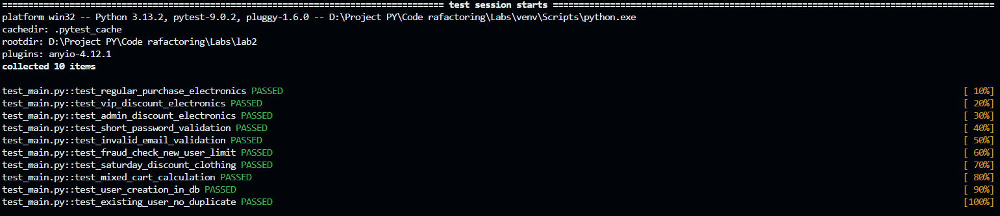

# Лабораторна робота 2. Рефакторинг коду

## Що було зроблено

В попередній лабораторній цей проект був одним великим файлом `main.py` ("спагеті-код"). У цій роботі я розбив його на логічні модулі, застосувавши принципи **SOLID** та **DRY**.

### Основні зміни:

1. **Ліквідація "God Object" (ShopManager)**
* Раніше клас `ShopManager` робив усе: від роботи з БД до відправки імейлів.
* **Тепер:** Логіка розділена на три сервіси:
* `auth_service.py` — реєстрація та пошук юзерів.
* `pricing_service.py` — чиста математика знижок.
* `order_service.py` — керування процесом замовлення.


2. **Заміна магічних чисел (Magic Numbers)**
* Всі незрозумілі цифри (`0.90`, `1`, `5`) винесені у файл `config.py`.
* Для категорій товарів та ролей юзерів тепер використовуються `Enum` (наприклад, `Category.ELECTRONICS` замість просто `1`).


3. **Валідація даних (Pydantic)**
* Замість "сирих" словників (`dict`), які викликали помилки, впроваджено Pydantic-схеми (`models.py`).
* Тепер API автоматично повертає зрозумілі помилки, якщо клієнт надіслав криві дані.


4. **Flat Architecture (Плоска структура)**
* Файли розділені за призначенням, але знаходяться в одній папці для зручності навігації.


---

## Структура проекту

* `main.py` — Точка входу. Тільки ендпоінти API.
* `config.py` — Налаштування, константи та Enums.
* `models.py` — Pydantic-схеми (UserSchema, PurchasePayload).
* `database.py` — Імітація бази даних (глобальні змінні).
* `auth_service.py` — Сервіс користувачів.
* `pricing_service.py` — Сервіс розрахунку ціни.
* `order_service.py` — Головний сервіс (Facade).
* `test_main.py` — Модульні тести.

---

## Як запустити

1. **Створити віртуальне оточення (якщо немає):**
```bash
python -m venv venv
.\venv\Scripts\activate
```


2. **Встановити залежності:**
```bash
pip install -r requirements.txt
```


3. **Запустити сервер:**
```bash
python -m uvicorn main:app --reload
```


Сервер буде доступний за адресою: `http://127.0.0.1:8000/docs`

---

## Тестування

Рефакторинг не зламав функціонал. Усі 10 тестів з попередньої роботи успішно проходять.

Команда для запуску тестів:

```bash
pytest test_main.py -v
```

**Результат:**

