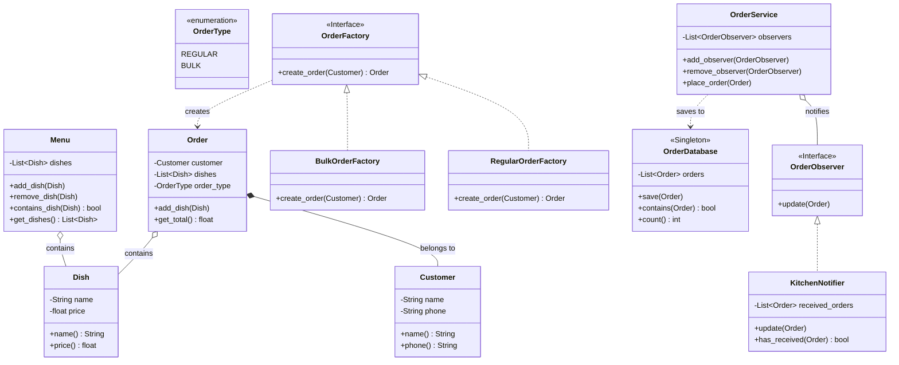

# Проектування системи замовлень ресторану

Цей проект реалізує систему управління замовленнями в ресторані з дотриманням принципів SOLID, методології TDD (Test-Driven Development) та з використанням популярних шаблонів проектування (Singleton, Factory, Observer).

## Частина 1: Проектування системи відповідно до принципів SOLID

### Аналіз проблеми та дизайн
У системі виділено наступні ключові класи:
- **`Menu`**: представляє колекцію доступних страв у ресторані.
- **`Order`**: представляє замовлення клієнта, містить список страв та логіку підрахунку загальної вартості.
- **`Customer`**: представляє особу, яка розміщує замовлення (зберігає ім'я та контактні дані).
- **`Dish`**: представляє один пункт у меню (назва та ціна).
- **`KitchenNotifier`**: Відповідає за оповіщення кухні про нові замовлення (реалізує інтерфейс спостерігача).
- **`OrderService`**: Сервіс для обробки замовлень, який зберігає їх у базу та сповіщає підписників (кухню).

### Діаграма класів UML
Діаграма розроблена з урахуванням принципів SOLID:
- **SRP (Принцип єдиної відповідальності)**: Кожен клас має лише одну причину для змін. Наприклад, `Dish` лише зберігає дані про страву, а `OrderDatabase` лише керує збереженням замовлень.
- **OCP (Принцип відкритості/закритості)**: Система відкрита для розширення (наприклад, додавання нових типів замовлень через `OrderFactory` або нових спостерігачів через `OrderObserver`), але закрита для модифікації.
- **DIP (Принцип інверсії залежностей)**: Класи залежать від абстракцій (наприклад, `OrderObserver`, `OrderFactory`), а не від конкретних реалізацій.



### Реалізація початкової версії класів
Було створено базові скелети класів та реалізовано їхню логіку з дотриманням SOLID. Кожен клас розміщено у відповідному модулі (`model`, `service`, `pattern`).

### Базові тести
Написано 12 базових модульних тестів (Частина 1), які перевіряють:
- Створення об'єктів `Dish` та `Customer` (з валідацією вхідних даних).
- Додавання та видалення страв у `Menu`.
- Асоціацію `Order` з `Customer` та правильний підрахунок суми замовлення.

---

## Частина 2: Розробка системи за допомогою TDD

### Реалізація функціоналу через TDD
Розробка велася через написання тестів до реалізації логіки (Test-Driven Development).
Функціонал, покритий TDD:
- Додавання страв в меню (перевірка наявності, підрахунок кількості).
- Створення замовлення та додавання до нього страв.
- Асоціювання замовлення з клієнтом (з перевіркою на `None`).
- Оповіщення кухні про нове замовлення через `OrderService`.

### Сценарії тестування
Тести охоплюють різні сценарії:
- Вдале і невдале додавання страв (наприклад, відхилення страв з від'ємною ціною або порожньою назвою).
- Обробка замовлень на кухню (сповіщення одного або декількох підписників, відсутність сповіщення після відписки).
- Робота з випадками, коли меню порожнє або замовлення не містить страв (сума 0).

Для цієї частини реалізовано ще 10 модульних тестів (зокрема для `OrderService` та взаємодії компонентів).

---

## Частина 3: Використання шаблонів проектування

### Застосовані шаблони проектування
1. **Singleton (Одинак)**: Використано для класу `OrderDatabase`. Це гарантує, що в усьому додатку існує лише один екземпляр бази даних, який зберігає список усіх розміщених замовлень.
2. **Factory Method (Фабричний метод)**: Реалізовано через `OrderFactory`, `RegularOrderFactory` та `BulkOrderFactory`. Дозволяє створювати різні типи замовлень (звичайні та масові зі знижкою 10%) без прив'язки до конкретних класів у клієнтському коді.
3. **Observer (Спостерігач)**: Реалізовано через інтерфейс `OrderObserver` та клас `KitchenNotifier`. `OrderService` виступає в ролі видавця, який сповіщає всіх підписаних спостерігачів (кухню) про нові замовлення. Це забезпечує слабку зв'язність (loose coupling) між системою замовлень та кухнею.

### Тестування шаблонів
Написано 8 модульних тестів для перевірки патернів та 1 повний інтеграційний тест (разом понад 10 тестів для Частини 3):
- **Singleton**: перевірка, що `OrderDatabase()` завжди повертає той самий екземпляр, і дані зберігаються між викликами.
- **Factory**: перевірка правильного створення типів замовлень та застосування знижки для масових замовлень.
- **Observer**: перевірка, що `KitchenNotifier` отримує сповіщення про всі нові замовлення.

---

## Звіт про тестування (Test Report)

У проекті реалізовано загалом **30 модульних тестів**, які успішно проходять.

**Журнал тестів (Test Log):**
- `test_01_create_dish_with_name_and_price` — Успішно
- `test_02_dish_rejects_blank_name` — Успішно
- `test_03_dish_rejects_negative_price` — Успішно
- `test_04_create_customer` — Успішно
- `test_05_customer_rejects_blank_name` — Успішно
- `test_06_add_dish_to_menu` — Успішно
- `test_07_menu_starts_empty` — Успішно
- `test_08_menu_size_grows_correctly` — Успішно
- `test_09_remove_dish_from_menu` — Успішно
- `test_10_order_associated_with_customer` — Успішно
- `test_11_order_total_calculated_correctly` — Успішно
- `test_12_order_rejects_none_customer` — Успішно
- `test_13_placing_order_saves_to_database` — Успішно
- `test_14_multiple_orders_saved_to_database` — Успішно
- `test_15_kitchen_notified_on_order` — Успішно
- `test_16_kitchen_not_notified_after_removal` — Успішно
- `test_17_multiple_observers_all_notified` — Успішно
- `test_18_service_rejects_none_order` — Успішно
- `test_19_singleton_returns_same_instance` — Успішно
- `test_20_singleton_data_persists` — Успішно
- `test_21_regular_factory_creates_regular_order` — Успішно
- `test_22_bulk_factory_creates_bulk_order` — Успішно
- `test_23_bulk_order_applies_10_percent_discount` — Успішно
- `test_24_regular_order_has_no_discount` — Успішно
- `test_25_kitchen_receives_all_orders` — Успішно
- `test_26_kitchen_empty_before_orders` — Успішно
- `test_27_empty_order_has_zero_total` — Успішно
- `test_28_menu_not_contains_unadded_dish` — Успішно
- `test_29_menu_get_dishes_returns_copy` — Успішно
- `test_30_full_flow` (Інтеграційний тест) — Успішно

**Результат запуску тестів:**
```text
..............................
----------------------------------------------------------------------
Ran 30 tests in 0.002s

OK
```

---

## Як запустити тести

Щоб запустити всі тести, відкрийте термінал, перейдіть до папки `lab4` та виконайте наступну команду:

```bash
cd lab4
python3 -m unittest discover -s tests
```

Або, якщо ви знаходитесь в корені проекту:

```bash
python3 -m unittest discover -s lab4/tests -t lab4
```
