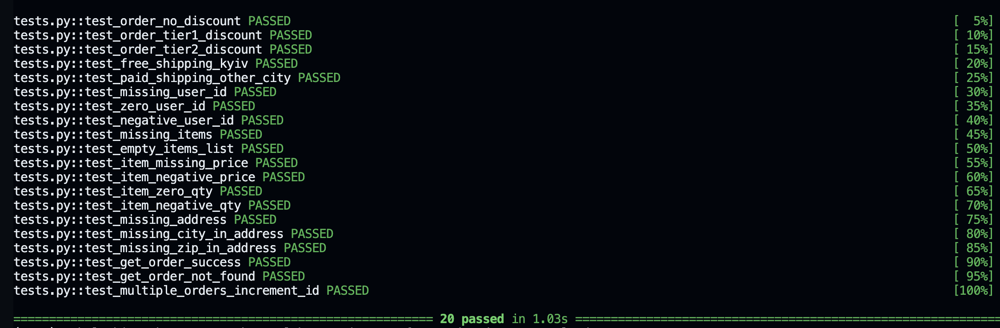
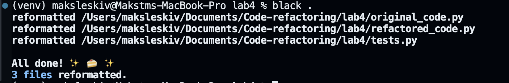
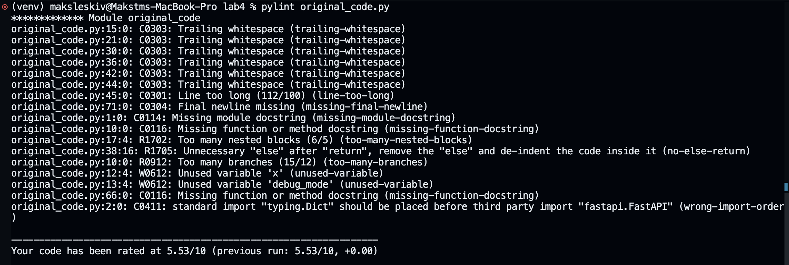
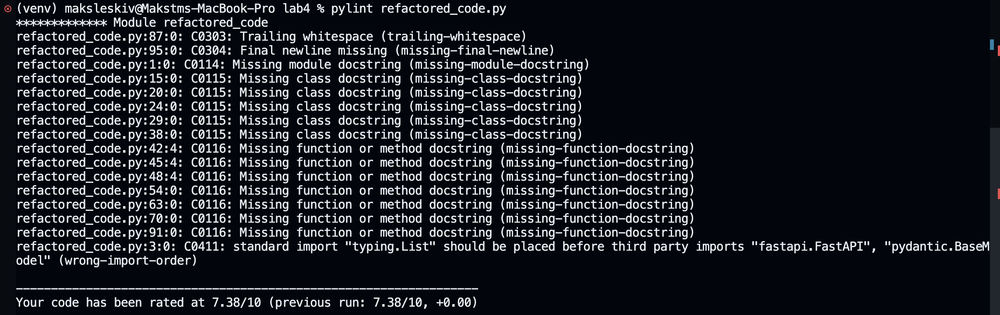

# FastAPI Проєкт: Рефакторинг коду

## Опис проєкту
Цей проєкт демонструє практичне застосування принципів рефакторингу (Clean Code) на базі фреймворку FastAPI. Проєкт містить дві версії мікросервісу для обробки замовлень: `original_code.py` (спадковий код із "запахами") та `refactored_code.py` (покращений код).

## Тести успішно пройдено

### Black Formatter

### Pylint
#### До рефакторенгу:

#### Після рефакторингу:

## Як запустити
### 1. Створіть віртуальне середовище

    pytohn -m venv venv - Windows
    python3 -m venv venv - MacOS/Linux

### 2. Активуйте вірутальне серидовище

    venv/Scripts/Activate.ps1 - Windows
    source venv/bin/activate - MacOS/Linux

### 3. Встановіть залежності:

    pip install -r requirements.txt

### 4. Запуск 

    uvicorn refactored_code:app --reload

### Тести

    pytest tests.py -v 

