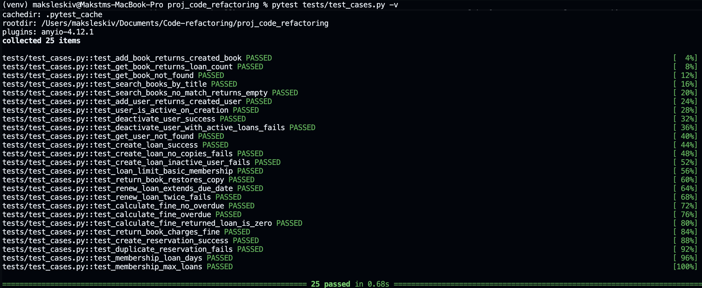

# Система управління бібліотекою — Проєкт з рефакторингу

FastAPI-додаток для управління бібліотекою, створений для демонстрації 10+ технік рефакторингу на реалістичній кодовій базі.

---

## Структура проєкту

```
library_project/
├── original_code.py           # Оригінальний код із 15 виявленими запахами коду
├── refactored_code.py         # Рефакторована версія з 10+ техніками
├── tests/
│   └── test_cases.py          # 25 юніт-тестів для основної логіки
├── docs/
│   ├── refactoring_report.md  # Детальний звіт: до/після, обґрунтування, метрики
│   └── README.md
```

---

## Предметна область

Система керує:
- **Книгами** — каталог з відстеженням кількості примірників
- **Користувачами** — 3 рівні членства (basic / premium / student)
- **Позиками** — видача книг з автоматичним розрахунком дати повернення
- **Резерваціями** — постановка в чергу на недоступні книги
- **Штрафами** — автоматичний розрахунок за прострочення

---

## Запуск додатку

### Віртуальне серидовище

```bash
python -m venv venv

venv\Scripts\activate.ps1  -- Windows
source venv/bin/activate  -- Linux/MacOS
```

### Залежності

```bash
pip install fastapi uvicorn pydantic httpx pytest
```

### Запуск рефакторованої версії

```bash
uvicorn refactored_code:app --reload
```

Документація API: http://localhost:8000/docs

### Запуск оригінальної версії

```bash
uvicorn original_code:app --reload --port 8001
```

---

## Запуск тестів

```bash
pytest tests/test_cases.py -v
```

### Результат:




## Лінтер
> original_code.py


> refactored_code.py


---


## Форматер коду Black

---

## Огляд технік рефакторингу

| № | Техніка | Ключова користь |
|---|---|---|
| 1 | Іменовані константи (видалення магічних чисел) | Єдине місце для бізнес-правил |
| 2 | Заміна тип-коду на Enum | Типобезпека + валідація API |
| 3 | Заміна умов таблицею пошуку | Без дубльованих if-elif ланцюгів |
| 4 | Заміна print() на логування | Готовність до продакшн-моніторингу |
| 5 | Виокремлення методу — `calculate_fine` | Усунуто 5× дублювання |
| 6 | Виокремлення методу — `get_X_or_404` | Чисті, читабельні обробники роутів |
| 7 | Розділення запиту та модифікатора | Відповідність CQS, без прихованих мутацій |
| 8 | Додавання захисної умови | Цілісність даних забезпечена |
| 9 | Декомпозиція умовного виразу | 6 рівнів вкладеності → плаский код |
| 10 | Заміна хардкодованого списку на дані | Коректна поведінка для будь-яких жанрів |

Повний опис із фрагментами коду до/після: [`docs/refactoring_report.md`](docs/refactoring_report.md)

---

## Ключові метрики

| Метрика | Оригінал | Після рефакторингу |
|---|---|---|
| Кількість функцій | 14 | 26 (+86%) |
| Кількість розгалужень (складність) | 59 | 32 (**−46%**) |
| Найдовша функція (рядків) | 81 | 45 (**−44%**) |
| Дублювання логіки штрафу | 5× | 0× (**−100%**) |
| Юніт-тести | — | 25/25  |